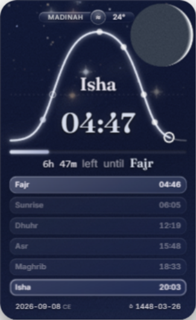
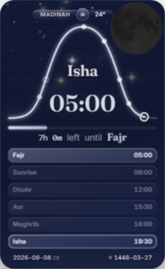
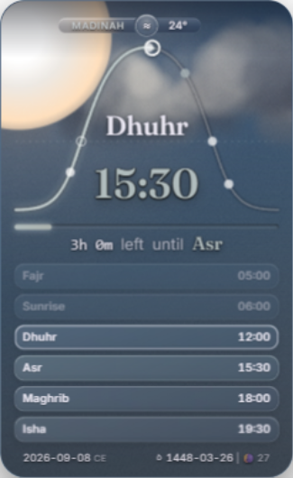
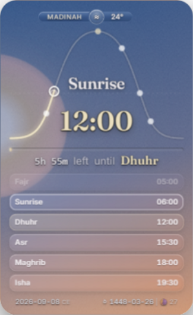
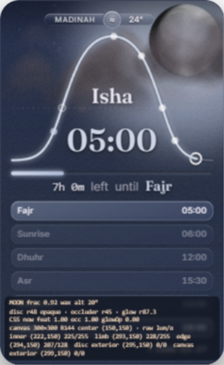
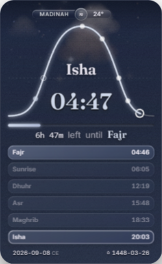
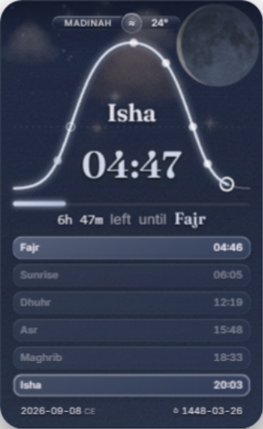

# Continuation native qualification receipt

This authored public receipt reconciles bounded immutable reviews from the same 37-work-order campaign. Runtime input `3960c62c2b30e2972872b1b927c0191fffde201c` / tree `0134c145b987320bc506ee822334d72093b2919f` has all 37 implementations joined, 31 QUALIFIED and six PARTIAL rows, and four QUALIFIED/four PARTIAL joins. Final six visual documents and two actual joined PBR documents are independently reviewed and root-accepted. The earlier d054/9e cuts and original23/14 audit remain historical. Final documentation/publication head and tree belong to external PR metadata.

The original 23/14 audit remains historical; later reviewed cells support only their explicit promotions. Shared root-owned captures are correlated. Reviewer tasks below independently inspected named subsets; this receipt author adds no visual-panel vote. Requested route was gpt-6.1-sol/max, with backend identity unexposed. Private harnesses, archives, full native JSON, tokens, logs and whole-app screenshots are excluded.

## Newly qualified issue and join cells

**R0004 / J01:** literal empty-store boot with URL/config timezone omitted, native device New York and qualified Tokyo Sep8 is accepted together with the explicit-zone positive and retained cache/day rejection controls. Four native neutral Loading/blank-date crops then two correct Sep8 crops discriminate the remaining ingress cell. Early stream prefixes, one truncation flag and first-ever compositor intervals are not credited. The later source-injection byte-count erratum preserves the same outcome.

**R000C / J03:** four native acquired inputs distinguish healthy20, missing/null temperature, genuine numeric0 and malformed precipitation with useful fields surviving. Installed/cache state and settled chip/effect pixels agree. Whole-record unavailable and precipitation quantity are not substitutes for the temperature control. Source/typed/unit/mutant controls remain applicable.

**R000F, R001B / J02:** intact source-bound builder form and one325x530 child, settings feedback and the locally rendered current privacy table/note are readable. Seven original crops and15 snapshots are independently reviewed. Earlier wrong-area/selector or tiled preview failures remain diagnostic and uncredited. Font-supplemental lineage is separate; request construction does not prove external delivery or provider retention.

**R0019 / J04:** actual trusted browser-translated touch opens both date views, selects the Gregorian word "full", scrolls the long body0→1118.6335→0, closes without hover and restores initiating focus. Actual events/consumer effects are decisive despite command timeouts. Initial CE open was1200x1000; subsequent selection/scroll/Close and AH paths were bounded325x530. Retained keyboard/full-value/provenance controls complete the issue contract. No physical-hardware or all-gesture325 claim is made.

**R001C:** both exact documented bare real-time recipes use native advancing Date with native reduced preference. The ordinary default reduces motion; motion=full overrides and the production readout agrees after16.5s. Date intervals16.217/16.172s and the early missing readout remain explicit. The earlier v2 zone-refusal was a fixture mismatch; corrected finite v3 targets do not alter the product or rewrite the documented fragment.

**R0024 / J03:** actual pre-R24/current W0/W1/W2 atmosphere work, cache hot/material miss,100 admitted records and native-Date passive windows70.0013/61.1785s satisfy the bounded measured-cost cell. W1 performs policy-different work; timer resolution/cache quantization and unmatched checkpoints limit comparison. Retained state stays bounded in the observed windows; this does not prove no allocation or long-run leaks. Shared MAIN/current `paint(atmosphere(M))` CPU is higher (excluding `render`, `renderMoon` and PBR work): clear0.037552→0.108290ms/call, night0.044731→0.104365. No efficiency/GPU/battery/arrival-provider claim follows.

**R001D:** exact3960 lastConsumed/current-canvas sampler and wrapped opt-in output complete the bounded issue contract; root accepted QUALIFIED with21 diagnostic/26 lunar source controls and final native association. The old662.215px clipping is repaired inside325px. Legacy CSS-now is a retained pre-paint snapshot (printed glow0 versus actual later DOMopacity.215991), not settled/live telemetry; exact A3–A4/B3–B4 do not require a new post-paint CSS row. The opt-in overlay covers lower rows/footer and does not pass ordinary-card readability or lunar art.

## Reviewed scopes that do not promote a whole row

**R0021:**16 fixed-target entries, three390x844/DPR1 browser-mobile-emulation repeats and a no-saved local projection support first-visible coherence. Initial visibility/source ordering, actual geometry and repeated pixels compose this claim. Desktop declared10/15s windows were shorter; mobile recordings exceed10s. Early UUID/predecessor/metadata gaps stay uncredited. Absolute first-ever compositor and physical-device coverage are not claimed and are not new blanket replay gates.

The pending-map erratum accepts truthful bounded partial initialization followed by natural8s recovery; early missing Moon pixels are not settled-presence proof. The local private-empty configuration starts with null projection, uses actual coarseDetect and a finite synthetic GeoJS response, then first exposes the accepted Madinah/NewYork projection at2130.3ms with98 anchors. Controlled Date and synthetic provider input do not certify live geolocation.

The original9e terminal decode error left an empty night Moon slot. External9a2 supplied a body but its nearly uniform grey.08 crescent failed owner and independent visual review. Corrected053b has bounded native acceptance for readable waxing/waning/half/new/full/gibbous phase presence, physical/forced-optics withdrawal, day suppression, partial decoded-albedo success, healthy controls and pending original-load recovery. The independent half-mask isolation keeps its outside probe visible, reveals the inside probe only with mask disabled and restores the actual scene. All15 documents are linked to sealed custody. These changes are joined at3960; final same-source phase/presence/light/recovery and actual joined PBR association are accepted within the recorded scopes. The earlier failures stay historical; no decoded terrain is invented when both maps fail, and early3.2295s pending emptiness is not presence proof.

**R0022:** physical eligibility zero, held-star wash release and isolated same-instant cloud moon-light withdrawal have scoped native acceptance. External combinedCalendar8 changes the bright full-below body to faint opaque textured ashen presence. Above-full PBR is exact; new-below is visibly stable but is not RGBA-byte-exact (819 changed pixels,maxRGB157,alpha exact). Cloudy terrain is substantially obscured. The below-ceiling is joined at3960. ExternalCalendar8 retains its original source identity. Final3960 confirms faint textured below-full presence, terminal phase, healthy positive and zero consumers, cache/up-path and joined PBR timing; clear-gibbous art remains failed.

The root-selected gibbous floor is an improvement that enforces the existing floor after RGBtint with no new constants/calibration. Meaningful textured dark limb at actual325x530 still FAILS even though texture exists in the300px native raster. Rejected lowSun caused passed-Fajr washout and is excluded. The overcast layer has scoped warm-white nucleus/static controls and sampled two-way fade acceptance, now joined at3960. A matched-minute16.024s quiet pair finds no observed aggregate CPU-duration increase at externalf21 versus9e; unequal style/layout counts and heap snapshots prevent efficiency/leak/GPU attribution. Final3960 native images now bind the composed overcast correction; the original fade/matched-cost controls retain their exact standalone source identities. SunriseGateA/B remains unresolved under the bounded no-patch assessment; this improvement does not erase it. No vote or diagnostic erases these limits.

**R0025:** seven native scopes are accepted: actual IO hold/return, natural empty/healthy return, ordinary no-render wall-clock adoption, natural local midnight, natural UTC midnight, isolated lunar cloud light and900x day trajectory milestones/final state. Actual IO hold65,995.6ms and return15,280.5ms use separate observers; no uninterrupted recording is claimed. Local/UTC controls run60,003.1/60,001.3ms. Retained five frozen-civil pairs/common source plus automatic daily adoption supply month/year applicability; no extra month/year replay is invented.

The trajectory runs120,005.8ms and observes5m/15m/60m/day milestones. Its retained stream has a51.478s gap; the nominal120000ms checkpoint loses a timer race. Final motion.lastRt is not a last painter/compositor timestamp. Positive elapsed wind3→4→3 is independently accepted with old-speed adoption; sparse pixels do not become continuous video.

Settled breathing knockout/restoration waits1381.9/1386/1383.2ms for the1.1s transition and restores model/drift/CSS targets. Five weather provenance timestamps prevent whole-A byte identity. Ordinary61s clear useful sky-breathing visual FAIL remains a recorded residual. Preserved slow MAIN airDrift/palette and combined visible cloud/star M0 do not create a new independent61s threshold or a broad clear-sky motion PASS.

## Joined runtime input and affected qualification

Root freezes runtime commit `3960c62c2b30e2972872b1b927c0191fffde201c`, tree `0134c145b987320bc506ee822334d72093b2919f`, parent9e. Index SHA-256 is `26cec992ec9816ba33bd50ce30c01f750fc2d2fbc080ade7f99b3b0da4666ac2`; config remains `91a37863cd85e232e9a63bba9db533b82699e63140086ba4b78fcf9c0581ec81`. This input identity is not the future doc/publication head. The six source changes are readout wrapping, sundog footprint, existing gibbous Earthshine floor, below-calendar ceiling/cache ordering, terminal-error phase fallback and overcast Sun layer. LowSun is excluded.

The actual final-source diagnostic21/21 and lunar-consumer26/26 controls pass; inline syntax passes. These are source/VM controls, not native art or cost. Independent final weather applicability preserves13 exact policy/cache/admission functions and the separately reviewed lunar-error guard in atmosphere. Historical `paint(atmosphere(M))` CPU excludes render/PBR and does not represent composed3960 timing.

Final same-source native association is complete: six visual documents,15 original PNGs and19 guarded states plus two actual joined PBR/cached/material/up-path documents. Root accepted the five sealed visual reader reports and the formal CLOUD cost/applicability report. All19 cloud/time/weather/media functions remain byte-identical; the changed healthy lunar interface is covered by the final actual caller. The seven earlier cloud leaves carry forward with their original observer/trajectory limitations, not seven fresh runs. Counts are31/6 and4/4; only named art/capability gaps remain.

At14:33:44–14:33:47Z, a fresh full37 issue-body/comments/dependency readback found37 unchanged OPEN issues, zero comments and no DAG drift. That interval still observes remote PR38 at9e and mainfd2972; root must bind the later pushed head separately. Exact decoded UTF-8 issue bodies are preserved without newline/Unicode normalization.

## Final actual PBR caller and cost

Baseline9e and final3960 use the same exact22:00 model/current weather/private clock. The measured path is model→renderMoon→atmosphere→paint/PBR. Positive/no-op controls call once, rasterize zero and keep the exact href. After24 warmups,121 cached batches each contain32 calls; material misses use8 warmups and21 one-raster observations. Cached joined median/p95 are7.0/8.5ms versus7.1/8.4ms per32 calls. Nested material-PBR median/p95 are7.1/8.4ms versus7.4/8.4ms. Native total durations are1.4558/1.5054s. Page ages differ15.0937/63.6331s and the documents are sequential; distributions overlap and approximately0.1ms quantization/observer overhead limits interpretation.

Final same-phase horizon transitions intentionally rasterize once versus old zero. Below-horizon light/cloud-moonLit becomes zero, then healthy positive.948 returns. All32 input actions and original references restore. The failed metadata-fetch document and candidate same-document host-alias recovery remain recorded; there is no successful cost replay. These measurements concern synchronous joined CPU/raster submission, not efficiency, isolated overhead, GPU/compositor/energy, cadence, startup/fallback cost, leaks or new motion qualification. Historical weather/shared paint(atmosphere(M)) measurements exclude render/PBR and stay distinct.

## Final native custody and root acceptance

Visual6 custody seal `14a0cb3dc42ae54313cb2df52b6548a7977e264762f17523249a9b2b341bae05` / manifest `01a8b881df5b07c8df5f347362247a0b290584d112ceaf4eb7ef747f59e57ff1` binds129 members/124 immutable original pairs plus two dated snapshots. PBR2 seal `3a34e98b17b7df7ba6e4253a3976e2048dca2e8c401f8b6486b4ba942da71943` / manifest `caf85baecd5705535a8d9c26d1df1753a8849ee33fbc9000218bc32b4a556798` binds99 members/94 immutable pairs plus two snapshots; the refused metadata-fetch UUID stays distinct. Full native JSON, archives and private paths are not published.

Root's R001D acceptance is `c699f8a89fbd3e3b66a6bf54924040bb4a76176d934c5feb8e23714f75134f31`. Final native association `89eeba04c9b0d59d20f80126dbfd4542771bfc299468acaf2592d924198db7e4` is supplemented by formal PBR association `14a7072b118dcfd40cc276e41deaea9cf52d86c9c72abf57d16e5c4348b5ab95`; no formal native review wait remains. Five final visual readers share root's captures and retain actual sunrise/clear-gibbous failures. The receipt author adds no extra panel vote.

## Final runtime original images

Seven unmodified325x530 originals below are selected from the sealed final3960 visual release. These are controlled synthetic scene captures, not new motion or live-provider evidence. Recorded native font helpers were used where stated, with `fontLayoutRefresh:false` and `postFontRenders0`; error-crescent fonts were observed passively. No all-natural font acquisition or first-ever-frame claim follows.

Settled terminal decoder-error waxing crescent. Readable right phase limb and opaque procedural calendar body; both failed maps supply no decoded terrain or physical moonlight. Scoped repaired presence, not a global Moon-art pass. Original SHA-256 `c0d8c1eff212be1ea23f3c0b778e409dc0ade17e9b98b55590b80f5f5ec61f94`.

Clear full Moon below the horizon: faint opaque textured calendar presence with zero atmospheric moonlight. This settled3960 scene does not pass the inherited clear-gibbous dark-limb gate. Original SHA-256 `3f072992a1a08a5af5b089bdc012c4318294a6b00dc43c7f056af7efdc3b88c7`.

Overcast noon after the bounded Sun-layer correction. Warm-white defined body is visible; the inherited large clipped geometry remains. Controlled model input does not claim observed local precipitation. Original SHA-256 `931552f5b5b2ac2ae0b4456baada07c8447142f45d6bdb4daddab0bb82694c69`.

Retained clear-sunrise FAIL: diffuse/clipped Sun nucleus and the low-sun art/readability limitation remain. Elapsed Fajr fade is the owner-directed hierarchy; the rejected lowSun extra washout patch is excluded. Original SHA-256 `cd7ab8d41adbf70b6fcda1a30f775dc04d18e82ac215ff7a48e8d25bc481b2b9`.

Opt-in wrapped diagnostic view with cloud55. The overlay covers lower rows/footer; default-card readability is not judged from it. CSS-now is a pre-paint snapshot, distinct from actual later DOM glow. Inherited clear-gibbous meaningful dark-limb texture remains FAIL; this cloudy view does not resolve that gate. Original SHA-256 `41cc536dd2b04bd7c54074af6f1ea26ccfc66b3145a670f29f3b6ba7b95757aa`.

Early original-map pending view: truthful partial initialization with an unavailable Moon surface. This image is not settled Moon-presence or first-visible/first-ever-frame proof; sampled state and capture clocks remain distinct. Original SHA-256 `dfef00f3cdc5f678276b4620c598a6675ee7425bcf84560b5b0c047fcb1d285c`.

After the original maps naturally release at8s, healthy textured PBR returns. This settled recovery is paired with the early image; it does not claim uninterrupted startup Moon presence or an error-then-late-load event. Original SHA-256 `a7bc48ea36a9dd85f4e1e7a4dfc592100846b97e8208f2ca046759f263f77e39`.

## Genuinely unavailable capability cells

Apple Bash3.2/macOS is unavailable on the currently exposed authorized host only for R0013/R0015/R0016 and J05. Modern Windows/Linux acceptance remains credited. The historical cross-UID blocker was resolved and is not carried forward.

Genuine document-hidden→resume remains current-environment blocked for R0025 and the relevant J07/J08 interface. Finite supported routes kept document visibility visible. Protocol freeze replied but actual production callbacks continued; it is neither suspension proof nor a product hidden failure. Real native offscreen acceptance is separate. No universal/permanent absence claim or new freeze gate is made.

## Actual reviewer records

Art12 has five independently authored sealed reader records at this cut: UI, weather, SKY, lunar and solar. Root adjudication and the author's residual report are separately attributed. Their differences stay visible: narrow sundog/floor/wrap improvements do not pass the actual-size gibbous or overcast/lowSun concerns. The solar reader's explicit erratum accepts removal of the parent sundog rectangle, withholding full distinct optics/registration; the newer overcast variant has a separate scoped review. Complete private reports are omitted; original report identities are recorded below.

| Reviewer task | Reviewed scope | Original report SHA-256 |
| --- | --- | --- |
| /root/review_weather_resume | R4 literal omitted-hint ingress | `7ad443bb5e63a47381b77c94a9f0487fc09cb5834a60a774fca89b37e2679986` |
| /root/review_weather_resume | R12 null/zero/partial fields | `72fb2d9e93e25a3422b466bb53fdea3feba348d1b9886e624d7e6a3417ad431c` |
| /root/review_weather_resume | R15/R27 intact preview/disclosure | `123f4b2ced9d659db501cae25c26fb6927beda4d63dc5687c44f85a70575ac0c` |
| /root/review_clock_native_resume | R25 actual translated touch | `7339f61eab65e9f42888bfe174c3815999eb25dfc4018af62ea9b3a6f7bdaf1e` |
| /root/review_clock_native_resume | R28 exact documented media recipes | `0f866d009c664aaf1f01e8fd4fd5589595aed3f9664ca01f9c1041747b0178bb` |
| /root/review_weather_resume | R36 native measured weather cost | `f71ae990530240ac6121768705d1cec99695c535a86708259a25eb2a935e600f` |
| /root/review_clock_native_resume | R29 temporary readable CSS trial | `61e0a8e44bad57c042928df610ef2ec22075b1a1f2c40573842f93137043e399` |
| /root/review_clock_native_resume | ENTRY16/mobile3 scoped pixels | `1a9ac163149429169a54fa91beba308de82e627ff3cc5edb33dec9b3020f1837` |
| /root/review_clock_native_resume | Pending-map classification erratum | `3cb854610c01b55da33170606ad49c357b4848ecbb6769f58a754b7c54ee4b32` |
| /root/review_clock_native_resume | First-visible contract reconciliation | `764106182d7ad961abff0335df10d0f615326b0bc8bb3b26c276a1a1704c5743` |
| /root/review_clock_native_resume | No-saved local first projection | `9753e1a30b6c36d1d4064660dea109f2256c1618cce71608497b5f7906edfd26` |
| /root/cloud_native_join_review | Seven native cloud/lifecycle scopes | `601c67dd21d9eba257522c00c7f8bab96d6eeba6a58a7980c1e80bd0a2ad505d` |
| /root/motion_review_resume | Native shared cost/old-wind | `6939550ba21e53b62a10948e94dc28306018866d33c025c735ca38ec04ad31dd` |
| /root/motion_review_resume | Settled breathing restoration | `4e0d393a2d7d3dab3d9ad32065aa225b938e5b373f028647c05715fa16faad5e` |
| /root/review_weather_resume | Bounded Apple host absence | `2f5abfba686a28a85526b4187d29a73d40b99fe5cd8c1c78567f551f5d4ebdca` |
| /root/review_clock_native_resume | Bounded genuine-hidden capability | `4c2e55b972e034802b6723c5764c717558cca48d89e3c847c82b4a47f8369bff` |
| /root/review_clock_native_resume | Actual freeze effect absent | `746b3586c56f96693eca05338fc76b4fabd8a3564d91c629f78f101f987f89ac` |
| /root/motion_review_resume | External Calendar8 moon | `8c3a4634e8ff71bddd8285aebb1f3a55d1d24742c856c361cf2496fd62cd2fe6` |
| /root/review_config_native_resume | External Calendar8 UI | `d5100e30e9084e563be5f2d7dfa95ebd285025738ee94815a9187b797e4b2d09` |
| /root/motion_review_resume | Old external fallback crescent FAIL | `0b9ef49fae4203b8b108930983d62a70ceccf9b05bed234b1ff04e4ca73c33ee` |
| /root/sky_qualification_prepare | External overcast layer scoped pixels | `7d64b5ae313a7e1a7ac6e03136ef5b9a03916fafb1514d1ce0e333cd1370cd05` |
| /root/review_config_native_resume | Art12 UI skeptic | `6c44ea64dc2e5cf007aa7a8a16c63de6b19e0fd7c32ca12e8b8eb1df3311bdcc` |
| /root/review_weather_resume | Art12 weather skeptic | `257987904f32d5782f0a42c72d970b59f197b80ccf02e0b07c754e34caa640d7` |
| /root/sky_qualification_prepare | Art12 SKY skeptic | `f8e525c5d214c73c38978de1514a3474c45bdf91a83f1b58b345c5ec2cab2c29` |
| /root/motion_review_resume | Art12 lunar skeptic | `3944ca58d0ea69c6986cae73f417e507ccf40f02cdfc4261b1d0e5d839a55f63` |
| /root/review_clock_native_resume | Art12 solar skeptic and sundog erratum | `15dba3d86d5c51d67ffa8ebac8805b217b1073469cf301c843de196620b1828c` |
| /root/review_clock_native_resume | External Calendar8 solar reader | `78132d9966fb4df780662000eae7ee121feb4d1b9738be216849841c0d5c6f3d` |
| /root/review_config_native_resume | External overcast layer UI | `4cafa50184e4fd7e858fb007e1ea16314d44b67cc758c6e74b269f659db340b7` |
| /root/prayer_reverse_review | Author gibbous/Sun residual | `20ab817b5279a4c11f377678e8885e173140d050c5b9ea344726c07afbe0dd71` |
| /root/motion_review_resume | Corrected external decoder15 | `fff743eafaa5566c0e51a7a4826aa36d6613730c36b0affac631af8260bd8e4d` |
| /root/motion_review_resume | Decoder15 custody association | `a59686e8699dc047a0f04632942d468308334e77b27ad10947fe278fb229eda4` |
| /root/review_clock_native_resume | Corrected half fallback mask | `55a28a9de829904792567d4fef7968bae969de13981f21f5452d7c40af232a01` |
| /root/sky_qualification_prepare | Overcast sampled native fade | `7fc01655b16cb0cc3843426ff2930dbcd8d21bd4c946d0c8661e1083bf6083b1` |
| /root/prayer_reverse_review | Overcast matched native cost | `a99dbb746e461e994f717082cd256f48b6f50fcb5bae62547908da27b01926f7` |
| /root/native_receipts_resume | Sun transition2 custody only | `b7bad8c5a08a65706559a3cc1e6e8d372b080790dfc2278bf5d3859398e3dc27` |
| /root/native_receipts_resume | Matched Sun cost custody only | `bbdeafe24061ca0ec0e94c3352a8927fa3034e2a1d022d5d9259eb75b54e5674` |
| /root/review_config_native_resume | Decoder and Sun transfer UI | `03c911554c0bf43b6260f87f428b309983bd9b43b2ed53f7c9bbbea99393cbf9` |
| /root/review_weather_resume | Final3960 weather source applicability | `107c12671dcb3c03e5156e6b4915a557acf149b16ddc597f0d7d32972e454dcc` |
| /root/review_clock_native_resume | Live37 unchanged contract map | `1953358bc348581bd6094caf34361c429335f27931e83b3f11555f780052ee0b` |
| /root/pbr_failure_prepare | Six-patch overlap preparation | `03596748a6b09310de22b742ab8929bdf05014fab7ad3fa9ca88331272fe9592` |
| /root | Runtime3960 focused source controls | `1286a95ad0ee77870a456031a85d627c349d26b41130a6afef605cd281d3c66a` |
| /root | Runtime3960 inline syntax | `5520ff9ca1423c25670ba772ffd579ffba228e6af4e976c735df07b286982c63` |
| /root | Runtime3960 root freeze | `61d9b8c87e5e61497c8d7c9d7f49ab66854be5ab19018696d2bff40da494901f` |
| /root/pbr_failure_prepare | Sunrise bounded no-patch assessment | `5eb69ee94616c667afac6789d1b290f30e9e564411ad5dcb2d056733b2aad0fa` |
| /root/review_clock_native_resume | Final3960 CLOCK diagnostics and visual scope | `5ada43f6ecc90c86c11b67ee7bfa04e450ddfd764756990e12ae84a69ce514f1` |
| /root/motion_review_resume | Final3960 MOTION lunar source and pixels | `fa0695ddd649f84c29c57b5030cbedbb50c5383542953d6594361884cb9a6b44` |
| /root/review_config_native_resume | Final3960 CONFIG UI scope | `998ef729c6308c66343fde4cf2fe953e1af71217e467c6ddb397b1fed9816a53` |
| /root/review_weather_resume | Final3960 WEATHER source and consumers | `6855ff1695419ae87577335c0944610efdd375105d94e71719e93c22e2f54fd6` |
| /root/sky_qualification_prepare | Final3960 SKY contract and visual scope | `bed4fd907ce6b63c3c31cc72ab2ba92754c45921f9f4f66dc9248ff6390211b9` |
| /root/cloud_native_join_review | Final3960 CLOUD actual PBR cost and applicability | `9a3691ad1986e9cf0576b2375b7a6160696a6414fa1197eb1f07d8015e894020` |
| /root/cloud_native_join_review | Final3960 CLOUD structured proof | `a38d9a8c701fc93ba2b6b48964053ab7901d5c0f53c71ded732659553c4499e6` |
| /root/native_receipts_resume | Final3960 visual6 custody | `14a0cb3dc42ae54313cb2df52b6548a7977e264762f17523249a9b2b341bae05` |
| /root/native_receipts_resume | Final3960 PBR2 custody | `3a34e98b17b7df7ba6e4253a3976e2048dca2e8c401f8b6486b4ba942da71943` |
| /root | Root R001D qualification | `c699f8a89fbd3e3b66a6bf54924040bb4a76176d934c5feb8e23714f75134f31` |
| /root | Root final native association | `89eeba04c9b0d59d20f80126dbfd4542771bfc299468acaf2592d924198db7e4` |
| /root | Root formal PBR association | `14a7072b118dcfd40cc276e41deaea9cf52d86c9c72abf57d16e5c4348b5ab95` |

No whole A–M/M0 cycle, campaign completion, owner approval, issue closure, main change or deployment is implied. Accepted final native association is bounded to the listed cells. See the [current 37-row/eight-join dossier](../../../rlgwo-implementation-dossier.md).
