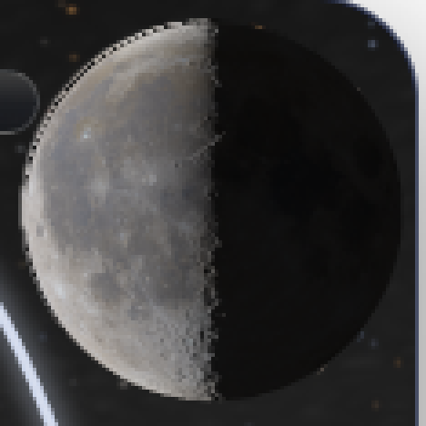
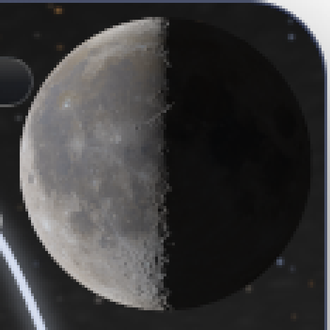
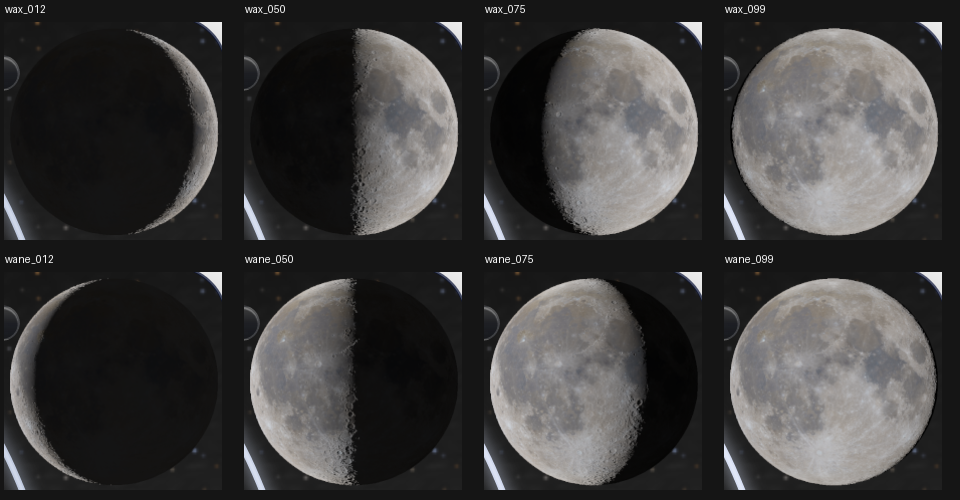
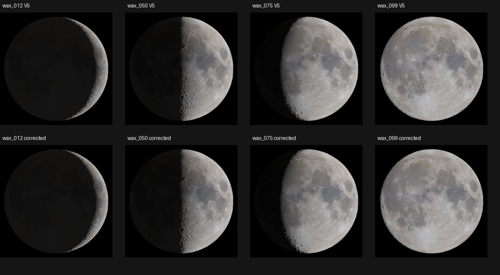

# Corrected Moon: bounded normal-clock rollout candidate

2026-10-07. This PR #40 follow-up fixes the demonstrated outer-limb composition
defect and Firefox preview starvation. It preserves PR #40's history and PR #39's
source branch. Publication is governed by the owner's explicit staged rollout:
preserve V1 first, verify it live, then merge CP9 and this corrected Moon.
This report records **local qualification**, not a completed deployment.

Runtime SHA256: `b234edc0f5cecb19a49c153130cb9a1c555aa6322dd28473f0a94e502ea7ee49`.
The [inventory](evidence/clock-20261007/runtime.json) and evidence manifest bind
the runtime and captures to the commit containing this report. The external
rollout receipt/PR description pins that commit as `FIXED_MOON_HEAD`; a file
cannot contain its own future commit hash. Two disposable builds were identical.

## Exact changes

- `moon/src/moon-detail.mjs` corrects the one-CSS-pixel border/containing-block
  offset and registers sampling to the displayed sky/cloud rectangles.
- `real-sky/native-composition.mjs` removes the lower-resolution duplicate Moon
  when the current device-resolution terrain layer owns presentation. Native
  loading/failure/retry fallback remains available.
- `moon/src/moon-precision.mjs` derives angular phase buckets from displayed
  device-pixel diameter while preserving the original 0.0416-pixel geometric
  error budget. `moon/src/moon-native.mjs` retains all generation/scene/profile
  fences and checks clock continuity at publication/read time as well as polling.
- Generated host, worker, build receipt, native sky bundle and offline entry were
  regenerated with the repository builder. Tests, diagnostics and this evidence
  are the remaining changes. No authored native prayer/settings/clock, sky-age
  limit, numerical Moon kernel, data, profile, exposure or quality tier changed.

The [rim diagnosis](RIM_CORRECTION.md) and [clock diagnosis/error derivation](CLOCK_CURRENTNESS.md)
explain the controls. [Donor drift](evidence/clock-20261007/post-donor-delta.json)
lists all twelve deliberate postimage changes, including the earlier horizon
correction. Historical byte-identical installer receipts do not qualify them.

## Visual and availability results

The old rim control fails: +1/+1 device-pixel offset, 8,671 duplicate base Moon
pixels and maximum outer-limb difference 136 codes. The corrected 324 cases
(nine phases, DPR 1/1.25/2/3, nine fractional placements) pass; 43,209 outer-limb
samples match the independent source-cell integration/browser composition with
zero code difference. Genuine resolved terrain contours are retained.

Nine fresh actual N540 adaptive solves cover both senses of crescent, half,
gibbous, near-full, and new, with a below-horizon opaque calendar control. Their
refinement times are 13.34–64.55s in Chromium. Every acceptance capture records
final worker identity/profile/quality and proves the old canvas is hidden:
poisoning it changes no displayed pixels; removing the detail reveals no second
Moon. Dark/bright/native-cloud checks pass. File-entry controls prove no interior
star leakage and exactly one cloud application. The footer strip does not recur.

The four retained V5 reference comparisons have maximum differences 1, 2, 4,
and 2 codes respectively; RMS differences remain 0.071–0.131 codes. These are
reported differences from phase bucketing/adaptive evaluation, not a new dense
scientific certificate. No V5 archive or research programme was reopened.

The original Firefox trace cancels viable work at 120s and 240s. Holding its
exact waning target proves completion in 136.371s worker time. The corrected
normal 1× trace reaches final terrain at 139.454s and remains ready through 303s,
without phase cancellation. The initial native scene initialization cancellation
occurs before any worker job. The earlier wrong-orientation held control is
excluded from this comparison and retained externally for traceability.

| Exact 330×534 root/V1 iframe | Chromium 148.0.7778.96 | Firefox 150.0.2 |
| --- | ---: | ---: |
| Prayer ready | 0.907s | 0.547s |
| Preview | 6.344s | 17.844s |
| Fully refined, current terrain | 39.797s | 139.453s |
| Maximum sampled UI heartbeat gap | 85.8ms | 56ms |
| Maximum scheduled control delay | 36.4ms | 1ms |

Both installed Windows engines pass 16 date/settings actions, normal countdown
and accepted sky UTC advancement, worker failure/retry, legacy iframe geometry,
V1-local configuration loading, isolated settings and reload. These checks use
controlled date/provider/font fixtures with real 1× timers, not live providers.

## Other gates and retained limits

- Moon components: 38/38, including old-fails/new-passes phase starvation and
  immediate forward/backward seek rejection. A→B→A, profile/reference, waxing,
  DPR, invalid native state, hidden/paused/disposed, malformed result and retry
  controls pass. Both phase senses at crescent/half/gibbous/near-full complete
  under the simulated slow-worker sequence at DPR 1 through 3.
- Independent phase displacement checks: 140,007 phase/diameter combinations
  preserve the original geometric budget. This is not a bound on every terrain
  shadow's photometric change. Diagnostics report the actual current bound.
- CP9 JavaScript 114/114; CP9 Python 18/18; actual-entry lifecycle 19 cases,
  386 assertions. The expanded native suite retains exactly the eight historical
  failures (one reveal, seven baseline-balance), four TODOs and explicit exclusions.
- File/offline: 11 checks, final refinement 54.31s. Missing, truncated and corrupt
  asset controls each pass eight checks, including real failure/retry.
- Frozen V1 verifier passes without `--check-root`, including static inclusion
  and disposable tamper detection. Its tree remains
  `87d4e9c9bd2b9d2a00164ab109fe00e9c25f9055`; manifest SHA256 remains
  `aa4bfcbc54f838e93d8ab41e58845efd753fcea80e8ebef3a784acf304e6a4cb`.
- Prospective main + #41 + #39 + corrected #40 merges are conflict-free and retain
  both V1 preservation and renderer ownership guidance. Runtime/V1 equivalence
  must be checked again against the pushed head before the staged merges.

N001/N002 remain PARTIAL and N003 remains BLOCKED. This is the owner's bounded
normal-clock rollout, not accelerated-clock or universal scientific approval.
Firefox still takes roughly 2.3 minutes here; preview/fallback during loading
is expected and is never final visual acceptance. Remote prayer/weather/font
services remain mutable. The installed browser versions, OS, fixtures, timings,
hashes and raw measurements are retained in the linked evidence. Full arrays,
all movement captures and diagnostic attempts remain outside Git at
`C:\Users\theis\Documents\Codex\moon-rim-rollout-20261007`.

No PR #38 implementation was used. No branch was rebased, force-pushed or deleted.
The final public root/V1 checks and Pages deployment identity belong to the
separate staged rollout receipt, after these local gates.
