# Receiving evidence index

Read [QUALIFICATION.md](../QUALIFICATION.md) for claims, failures and limits.
The source is PR #39 at `1977217cc2ac26fcc436b991aff498d306a0cd26`; this is the
dependent Moon candidate. [MANIFEST.json](MANIFEST.json) binds the copied raw
observations and lossless gzip payloads by stored and decompressed SHA-256.
[SOURCE_INVENTORY.json](SOURCE_INVENTORY.json) binds authored owners and current
qualification tools; [runtime identity](../CANDIDATE_RUNTIME_IDENTITY.json) binds
all served bytes. Counts do not represent independent reviews.

The evidence folder contains only selected receiving receipts/pixels/tools. The
original integration ZIP is preserved externally. Four original reference PNGs
and selected metadata were read from Part01 only to satisfy the later requested
phase comparison; [custody](v5-phase-references/reference-custody.json) records
that scope. Parts02–15 were not opened and no research campaign was rerun.
Unaltered donor provenance/report material is in
[`../donor/`](../donor/REPORT.md); it is historical evidence, not new receiving
qualification or additional user instructions.

## Application and tests

- [ZIP intake](intake.json), [preimage check](moon-check.json),
  [original linked-worktree refusal](original-apply-refusal.json),
  [guarded application](moon-apply.json), [installed verification](moon-installed.json).
- [Receiving adapter diffs](../receiving/README.md);
  [original Windows installer failures](installer-tests-windows.log),
  [worktree reproduction](installer-worktree-red.log),
  [intermediate fixture failures](installer-worktree-green.log),
  [20 PASS / two SKIP](installer-worktree-green-final.log).
- [Final commands](final-checks/commands.json),
  [environment](final-checks/environment.json),
  [two builds and package/postimage verification](final-checks/),
  [33 Moon tests](final-checks/moon/moon-node.tap),
  [111 CP9 tests](final-checks/integration.log),
  [final affected fixture transport](final-checks/fixture-transport.log).
- [Parent native baseline](baseline-native/results.json),
  [initial fixture-incompatible candidate](candidate-native/results.json),
  [887 PASS with eight retained failures / four TODOs](candidate-native-final/results.json).
  Final native logs and baseline failing comparisons are retained beside these
  records. `status: FAIL` is intentionally preserved in both native aggregates.
- [Final runtime after the requested horizon fix](post-horizon/runtime-identity.json),
  [sequential affected checks and two deterministic builds](post-horizon/commands.json),
  [five explicit deviations from donor postimages](post-horizon/post-donor-delta.json).
  The initial original installer verification passed; its final drift refusal
  is expected and retained, not described as a fresh 189-postimage PASS.

## Browser observations

| Observation | Raw receipt |
|---|---|
| Final four-phase terrain and layer acceptance | [Full results](moon-visual-qualified/results.json), [commands and failed attempts](moon-visual-commands.json) |
| Final bright/night bottom-border correction | [Before/after receipt](post-horizon/horizon-browser/results.json.gz) |
| Final HTTP / single-file refined Moon, clouds and UI | [HTTP](post-horizon/moon-http/results.json), [single-file](post-horizon/moon-file/results.json) |
| Final CP9 lifecycle / smoke | [386 assertions](post-horizon/cp9-lifecycle/results.json.gz), [141 assertions](post-horizon/native-smoke/results.json.gz) |
| Final CP9 geometry / composition / cache | [87 control assertions](post-horizon/cp9-controls/results.json), [composition](post-horizon/cp9-composition/results.json), [13 cache assertions](post-horizon/cp9-presentation/results.json) |
| Original supplied HTTP DPR 1 / DPR 3 | [DPR 1](moon-http/receipt.json), [DPR 3](moon-http-dpr3/receipt.json) |
| Original runner refused file navigation | [Failed receipt](moon-file/receipt.json) |
| Corrected genuine single-file entry | [Offline file](moon-file-native/receipt.json) |
| Asset rejection and recovery | [Missing](moon-asset-missing/receipt.json), [truncated](moon-asset-truncated/receipt.json), [corrupt](moon-asset-corrupt/receipt.json) |
| Actual HTTP refined phase series | [Results](moon-receiving-http/results.json) |
| Corrected actual HTTP cloud field | [Results](moon-clouds-http/results.json) |
| Regular `file:index.html` and clouds | [Results](moon-file-index/results.json) |
| Explicit UI actions in `refining` | [Final results](moon-refining-ui/results.json) |
| CP9 lifecycle, 19 cases / 386 assertions | [Lossless results](cp9-lifecycle/results.json.gz) |
| CP9 page/elevation/resize and presentation | [87 assertions](cp9-controls/results.json), [13 assertions](cp9-presentation/results.json) |
| CP9 fallback material and composition | [Material](cp9-material/results.json), [composition](cp9-composition/results.json) |
| Native scene matrix | [88-assertion verdict](cp9-scenes-verdict.json), [raw 15 scenes](cp9-scenes/results.json.gz) |
| Smoke before/after wrapper correction | [Original failure](native-smoke/results.json), [final 141 PASS](native-smoke-wrapper-fixed/results.json.gz), [rendered callback log](native-smoke-wrapper-fixed/rendered.txt) |
| Wall-clock motion, three 20-second watches | [Results](live-motion/results.json.gz) |

The first phase series recorded a `native-clouds` PASS while weather was actually
absent. **That one assertion is superseded and is not accepted cloud evidence.**
The other phase/protocol observations remain useful. The next harness used the
native `startWeather` owner and required visible cloud alpha. Its HTTP/file
results establish the corrected claim. The final harness also repeats date and
settings actions after the preview, requiring actual `refining` state and both
250 ms limits. The two earlier harnesses are retained in `receiving-harness/`
so each raw report's harness SHA remains reproducible. The final harness is
[`tools/cp9/moon_receiving_check.py`](../../../tools/cp9/moon_receiving_check.py).

The supplied browser runner uses route-fulfilled HTTP; corrected navigation and
the receiving tool use genuine local resources. File and offline tests use
ordinary Windows file URLs, not a synthetic `set_content` success. The CP9 scene
matrix *does* use expanded-document fixtures and captures native fallback while
Moon is loading. Do not confuse those scopes. Prayer/weather/date fixtures do
not certify live services, and short CSP smoke does not certify refined WASM.

The older receipts bind the pre-horizon runtime `ef263151…`; the final runtime is
`13fb06bc…`. The final actual-widget Moon captures are under
`moon-visual-qualified/`. Affected final CP9 composition, material, presentation,
controls, smoke, lifecycle and HTTP/single-file Moon checks are under
`post-horizon/`; consult their command receipts rather than treating older
physical-sky screenshots as final-candidate images.

## Pixels

These primary captures show the final actual HTTP widget at DPR 2, with the
canonical 540px terrain workload. Every image waited for `ready`, no pending work,
`empirical-adaptive` and zero unsettled samples. Each linked source proof records
the final worker identity, quality history, exact adopted arrays, current base
surface, hidden legacy layers and screenshot hashes. The dark side matches the
muted, textured original V5 presentation.

| Phase | Actual refined widget crop | Original V5 reference | Full widget and recorded state |
|---|---|---|---|
| Crescent 0.12 | 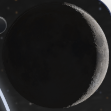 | 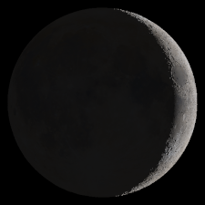 | [Widget](moon-visual-qualified/wax_012-widget.png), [proof](moon-visual-qualified/wax_012-source-proof.json) |
| Half 0.50 | 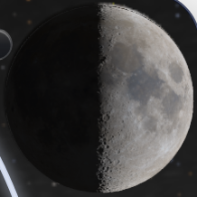 | 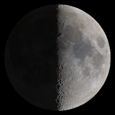 | [Widget](moon-visual-qualified/wax_050-widget.png), [proof](moon-visual-qualified/wax_050-source-proof.json) |
| Gibbous 0.75 | 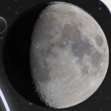 | 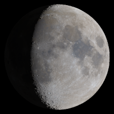 | [Widget](moon-visual-qualified/wax_075-widget.png), [proof](moon-visual-qualified/wax_075-source-proof.json) |
| Near-full 0.99 | 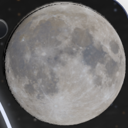 | 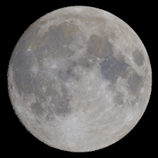 | [Widget](moon-visual-qualified/wax_099-widget.png), [proof](moon-visual-qualified/wax_099-source-proof.json) |

The hidden fallback is visibly different: [legacy crescent](moon-visual-qualified/wax_012-legacy.png).
Replacing its canvas and hidden SVG with magenta changes **zero pixels** in all
four refined crops. Hiding the detail canvas changes 27,787–34,238 pixels and
reveals the coarser CP9 raster of the same terrain; restoring it changes zero.
Diagnostic controls are beside each crop, explicitly named `diagnostic-*`.
The matched-footprint `*-worker-D208.png` images independently integrate the
actual worker surface on black: each differs from its reference by at most one
colour code. That comparison does not re-run or certify the full V5 research.

The earlier phase gallery is retained as receiving history, including
[new Moon](moon-receiving-http/new.png) and
[below-horizon token](moon-receiving-http/below-horizon-calendar.png).

| Actual native clouds, HTTP | Actual native clouds, regular file entry |
|---|---|
|  | 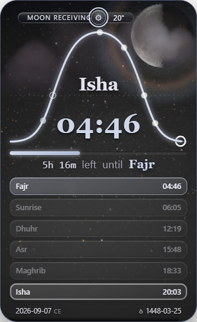 |

The separate `cp9-scenes/` crops explicitly recorded Moon `loading` and show the
retained fallback. **They are not final Moon visual qualification.** Their old
smooth blue Moon is the native PBR surface, not a fully refined V5 result.

Three earlier lineage-harness failures are preserved under
`moon-visual-acceptance/`, `moon-visual-final/` and `moon-visual-refined/`, with their
exact harness versions. They revealed transparent-edge canvas quantization,
the valid terrain source in the base compositor, and Chromium backing-store
migration under repeated readback. [A standalone probe](canvas_readback_probe.json)
reproduces the last effect. Final checks still require exact opaque RGB/coverage,
at most one premultiplied edge code, matching worker identity and adopted arrays,
and the displayed-pixel layer controls. No runtime or fallback was altered to
make these tests pass.

Motion evidence: [default clip](live-motion/default-live.webm),
[OS-reduced clip](live-motion/os-reduced.webm),
[`motion=full` clip](live-motion/full-override.webm), plus start/end PNGs and
pixel-difference observations. The reduced case has small residual pixel
changes; it is not reported as perfectly static. No cloud hash is used as proof.

To inspect a large record, decompress with Python's standard `gzip` module and
parse the resulting JSON. Every retained JSON record parses strictly; existing
CP9 lifecycle non-finite diagnostics carry explicit serialization metadata.
The local source evidence root is recorded in the command receipts. It remains
outside the repository and contains intermediate logs in addition to this
bounded, reviewable selection.

## Horizon boundary fix

The user's bottom-border crop led to a paired reproduction. The strip
exists on unchanged PR #39. It is
drawn by CP9's physical-sky raster; removing CSS shadows, text, glass and SVG
leaves it. The default camera's final sampling row lies exactly on the horizon,
where the optimized visibility predicate can disagree with inverse projection
through floating-point rounding. Zero grid values blend into the last few rows.
The user then requested a correction on this dependent branch. The authored
`tools/native_core_horizon.py` applies one digest-guarded predicate correction
through the builder. Near-zero optimized decisions use the existing exact
inverse projection; negative altitudes stay excluded. Immutable vendor input,
camera, footer geometry and the parent comparison branch are preserved.

| Scene | Unchanged PR #39 | Fixed Moon candidate |
|---|---|---|
| Overcast | 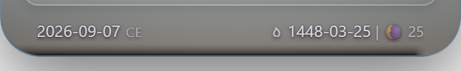 | 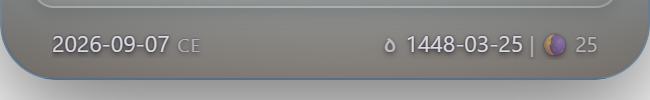 |
| Night | 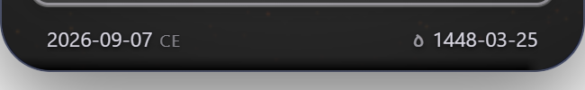 | 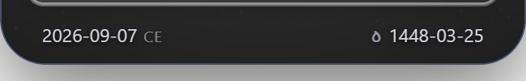 |

[Layer/geometry observations](footer-layer-probe/results.json),
[numerical horizon predicate](footer-layer-probe/horizon-projection.json),
[read-only reproduction tool](receiving-harness/footer_layer_probe.py).
[Final before/after receipt](post-horizon/horizon-browser/results.json.gz),
[red regression](horizon-red-valid.log), [green regression](horizon-green-final.log).
The first red log includes a corrected test observer-field mistake; the first
green log caught an overly broad assertion about the original faulty predicate.
All corrected boundary/radiance tests pass. The original attachment is not
republished; these are fresh actual HTTP crops. These short footer-only captures
do not qualify lunar refinement or close unrelated CP9 gates.
