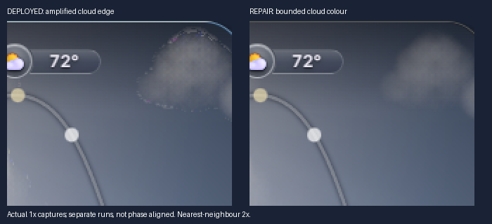

# Current-widget startup and cloud repair

## Current frontier — joined qualification remains open

**Current runtime candidate: V37, following rejected f05f1dc8.** Main remains
`c1a480c97e9af188cf57704502d818c0584cf265`. No merge is authorised. The spatial H7 repair remains
in the final runtime; recolouring alone was not accepted. Chromium/Firefox
V35b camera/dusk comparisons completed; V36 repeated Chromium after repairing
the native solar-presence boundary. V37 additionally repairs the demonstrated
lunar veil, with joined qualification still in progress. Runtime tree SHA-256:
`814dadc44c413bb177571a59b74ef00c71e1a9c5d4bbd7ebd3c768ad5a6e0246`.
The final served entry hashes to
`be483ce7123fe3873021264f1b16ea80661f8ef4934de4807f0e1c5aaf8161c1`.

The new lunar ablation uses the exact half-waning Maghrib fixture. Physical
sky Moon altitude is -29.59 degrees; the explicitly declared native lunar
presentation overrides are fraction0.5, waning, altitude+25 and H42. Thus
presentationUp=1 and calendar blend=0. This is a controlled lunar fixture,
not an assertion that the real Moon was above the Orlando horizon. The accepted
profile is calendar-neutral-v5-01; surface50700308a3b9fdd13c23a041fec836967b65a0615a6c1a3615e310a4f181feed.
A fresh diagnostic WASM solve exactly matches its primary array. The dark
hemisphere is Earthshine: its solar-only field is zero in the sampled interior,
while the Earthlit material retains21% relative luminance variation there.

The grey veil is the retained `.mcorona`: opacity0.257 in the clear fixture,
created from high dew point alone. It originally preceded the opaque SVG
photo, but the new terrain canvas was inserted BEFORE the entire SVG, placing
that bright-centred gradient over Earthshine. Removing only this layer removes
the broad lift; the material, atmospheric background and exposure are unchanged.
V37 restores the opaque terrain after the native optical background, leaving
clouds in the existing once-only local join and weather/UI above it. Corona
eligibility now requires admitted mid-level water cloud or fog; humidity/dew
point alone does not establish a droplet column. This is neither an Earthshine
brightness change nor a numerical lunar-model change. The old layer order and
clear/humid condition both fail discriminating controls. The focused21 native
and42 lunar component checks pass. Actual clear composition passes its ordering
gate; normal1x/moving/weather/browser and outer-limb checks remain open.

V36 also fixes a separate coupled-trajectory mismatch found in the dusk movie:
`sunMetrics` fitted solar altitude to prayer-table sunrise/sunset, while the
physical sky used accepted astronomical geometry. At physical-2.07 degrees,
the native fit was-0.4 and still displayed the body. `atmosphere()` now shares
the already accepted physical Sun used by cloud lighting for body/horizon and
lunar day fade; the prayer arc, timetable and approved size curve are unchanged.
The old boundary fails the new negative control;20 native tests pass. This did
not move the astronomical sky behind the decorative Sun. A separate-19.18-degree
refined/preview check gave identical25/25/25 upper and36/36/36 lower samples;
no additional night-mapping change was justified by that check.

The exact -8.63985-degree scene is the sanitised Orlando fixture at
2026-10-07T23:40:00Z, camera180/45/90, clear provider fixture. In the reported
lower-right ray (altitude approximately4.24, azimuth198.75), the dominant
contributor is **single-scattered solar light**, not artificial skyglow,
an Isha-row glow or attached decorative glare. At azimuth198.75/altitude5,
the coarse model gives0.31944cd/m² solar luminance versus0.02423 at zenith.
A128x128 direct quadrature gives0.29936 at5degrees; aerosol removal leaves
the coarse0.31944 unchanged. The empirical residual is zero at that knot.
The raw vertical maximum lies near4..5degrees above the horizon, where the
line of sight intersects illuminated air beyond Earth's shadow. The coarse
5-degree lookup changes its profile but does not invent that maximum. This
is an approximate single-scattering model, not measured angular twilight.
See `h8/twilight-spatial-components-v34.json` for the complete ablation.

V35b limits the **displayed solar highlight's spatial contrast**, beginning
half a stop above the atmospheric median and asymptoting at one stop. V33b's
two-stop ceiling retained the conspicuous patch even after its hue changed.
The operator changes neither ray coordinates nor raw radiance/exposure, and
cannot reduce independently owned non-solar light. Its twilight activation
is unchanged. This is an explicit presentation limit, not new calibration.
The exact upper-sky control remainsRGB21/27/46; daylight is unchanged.
The spatial negative control fails V34 and passes V35b. Passing that number
alone is not visual approval; actual-size complete compositions remain required.

The heading sweep also found a separate late-dusk rebound: the whole-field
-12..-18-degree handoff brought uncorrected solar light back as the raw
physical solar flux fell. Night adaptation now restores only the non-solar
background. Solar light remains on its continuous display path until absent.
The old handoff fails a one-minute continuity control; all20 affected preview
tests now pass. The immutable core/model data are unchanged.

V33b also removes normal legacy/preview lunar substitution: only a current
`empirical-adaptive` terrain result publishes. Loading/failure is explicitly
withheld, never mislabelled refined. The below-horizon calendar presentation
now scales the refined phase/relief to no more than the old total display
luminance, retaining zero physical moonlight. Chromium and Firefox completed
fresh V33b solves; primary terrain and coverage hashes match the retained
qualified surfaces. V35b's paired sky comparisons hold those lunar inputs and
material fixed. Current native/ownership fixtures were updated to require
an admitted terrain boundary; decoded old maps no longer grant a cutout.

V35b Chromium has completed four actual-widget camera headings and151
continuous60x dusk captures, with no semantic/currentness failures or sky
withdrawals. Its fresh quarter solve took63.328s. The subsequent motion test
reuses only that exact numerical lunar scene through current request envelopes;
it is composition evidence, **not** accelerated terrain-throughput evidence.
Firefox/partial-cloud/fractional-DPR comparison also completed151 captures with no semantic failures; fresh terrain took213.062s. Dawn, joined
normal-clock/recovery and final runtime qualification remain open. No blanket
H1-H8 PASS, N001/N002/N003 closure or public repair is claimed.

### Historical frontier and controls

**Latest local candidate: V32, uncommitted follow-up to f05f1dc8.** Directional
twilight and star-return work extends the same H2/H7/H8 register below. It does
not replace the remaining joined gates or authorize merging. Runtime receipts
under `h8/` identify the final served bytes, not the intermediate builder print.

The owner's precise -8.64-degree amber-pool crop remains an H7 acceptance input.
The short V31 profile capture showed a refined **sky**, but the Moon was still
`rendering/pending`, `legacyFallback=true`, with no accepted terrain or visible
detail. It had no phase override: native waning fraction0.0736464, altitude
-27.55 degrees. This is explicitly fallback evidence, not V5 acceptance.
The same paused scene subsequently reached `ready/empirical-adaptive` in Firefox
after148.3 seconds and Chromium after45.7 seconds. The V32 Chromium paired control
observes the adopted540x540 worker arrays: the solar shoulder changes neither
surface, calendar material nor coverage hashes. The base reports zero lunar
pixels and `device-resolution-owned`; the actual detail layer is visible.
Before/after images use identical accepted fields and terrain, with only the
solar-shoulder policy disabled for the counterfactual. They retain horizon warmth
while reducing its pool behind the lower rows. They are paused comparisons, not
motion qualification. See `h8/joined-v32-chromium-amber-native/`; its Firefox
above-horizon phase comparison and the complete joined campaign remain pending.
The first V31 Firefox helper mistakenly attempted array hashing on the published
canvas; its null hashes are excluded (see its `LIMITATIONS.json`). Its captured
renderer state/pixels remain usable. The corrected helper refuses missing arrays.
At23:40Z in the explicitly substituted Orlando clear fixture, LPOLL is zero,
the physical Moon is below the horizon, and attached solar light is absent.
At(280,491), the camera looks4.24 degrees above the horizon at azimuth198.75;
the physical Sun is at azimuth268.07. Solar single scattering dominates:
total solar luminance0.27652cd/m²-equivalent, natural residual0.000368,
physical moonlight0, artificial/local0. The empirical twilight addition is
small there. Finer128x128 quadrature retains the warm, bright solar field;
this is not evidence of calibrated horizon brightness/colour. Before the new
display shoulder, the atmosphere maps toRGB104/86/46 at that point and
127/106/58 farther right, while upper open sky stays around21/27/46.
The model's directional response does not by itself qualify that presentation.

V25 adds a declared solar-only twilight display shoulder. It leaves values
below2x the adapted field median exact, then rolls highlights continuously
toward4x; it uses the existing smooth -3..-5-degree twilight activation. It
does not change raw radiance, ephemerides, field coordinates or solar size,
and cannot remove non-solar light. The daytime path is byte-identical. The
negative crop control fails V24, and21 affected preview/star tests pass V25.
The first complete refined-sky crop reduces the amber pool while retaining
warm horizon light; its upper sample and bright-star count107 are unchanged.
This is a proposed display repair, not owner approval or calibrated photometry.
Both-engine moving, weather and joined qualification remain open. V28 uses the
worker's identical spatial grid for the refined solar-component decomposition;
the shoulder cannot accidentally remove neutral light through mismatched grids.
At the exact crop, the isolated lower region's 95th-percentile display-linear
luminance falls from 0.1232 to 0.0392, while its median is almost unchanged
(0.02450 to 0.02408). Warm pixels remain. At -13 degrees the before/after field
is identical. See `h8/amber-crop-v30/`: this is atmosphere-only display evidence,
with explicit exclusions, not a complete-widget or continuous-motion claim.

V22/V23 remove redundant preview encoding and cull stellar PSF work only when
a conservative summed-flux bound proves no displayed byte can change. Exact
byte comparisons cover the masked compositor and daytime culling. V24 also
avoids reading decorative solar DOM geometry for physical cloud lighting.
The first full26h600x tests retained a coherent preview but flagged ages from
asynchronous qaState snapshots. A separate final-document-rAF probe at V25
recorded376 clear and414 partial-cloud samples, maximum ages27.00/29.64s,
zero expired presented frames. The harness now pairs age bytes with the actual
screenshot in the unused iframe gutter and retains every rAF's age separately.
This correction does not widen the30s limit or qualify full-worker throughput.
Subsequent full-cycle V25/V26/V28 runs did expose genuine publication/preview
gaps and are retained as failed controls, not promoted by the short probe.
V27 rechecks the original job after the final lunar join. V29 moves foreground
and layout preparation before starting a new astronomical job and checks the
accepted clock even when the browser's rAF timestamp is delayed. V30 removes a
second synchronous preview calculation from native paint notification: preview
rAF is the single ongoing producer, while bootstrap still paints immediately.
Three deterministic negative controls fail the old host. V31 moves ongoing
preview publication to the end of the native paint opportunity, eliminating the
second loop and the pre-native-paint age expenditure. Its26h600x runs have zero
expired presented frames but still one Chromium and nine Firefox withdrawals;
the last Firefox capture exposed a dark backing field and fails acceptance.
V32 removes redundant horizontal-integral work and zero-channel writes from the
bright-preview PSF. Every binary64 sample matches the immutable reference
renderer, including clipped/fractional sources; support, spectrum and halo remain
exact. No sky-age limit, clock rate, astronomy, raster sampling or terrain quality
changed. Full moving qualification is being rerun; previous withdrawn/expired
captures are retained as failures, not a clean final gate.

The camera-rotation control distinguishes two contributions. The raw twilight
maximum follows the physical western horizon; there is no ground-bounce term.
Above the horizon, the previous decorative forward-aerosol registration also
pulled a bright lobe toward the corner body and released it over0..6 degrees.
Registration now leaves the twilight domain through+10 degrees entirely in
physical directions and joins the established daytime treatment smoothly over
10..20 degrees. The accepted >=20-degree path is unchanged. Native cloud
lining and local warmth now use the same accepted physical solar direction and
inverse camera rays instead of the prayer arc or a whole-deck warm mix. These
are declared presentation boundaries; no sky camera, ephemeris or raw physical
radiance is moved. Two registration negative controls fail the old owner.

The reported starless60x sequence exposed a different missing contributor:
the ongoing atmospheric preview contained no catalogue stars. The physical
solver itself has no twilight/prayer visibility switch. A pinned, magnitude
<=4.5 catalogue preview now uses the existing astrometry, spectral extinction
and integrated stellar PSF. Contrast against the displayed sky and native
cloud transmission controls visible return; no source is artificially boosted.
The full registered diffuse/faint-star worker tier remains unchanged. The badge
discloses current preview versus unavailable refinement. This is not a PASS of
the historical full-tier60x/600x throughput obligation.

V20 Chromium dusk60x completed361 captures. Its Firefox dusk run consumed
unavailable weather, so it is retained only as a no-weather/star-preview control,
not partial-cloud qualification. A Windows encoding error in the test fixture
and a paused-clock setup that did not enter explicit weather preview were
identified. Current camera/star comparisons assert the actual consumed code,
cloud fraction and amount. The earlier weather-unavailable camera ablations
remain labelled diagnostics. The clear V21 settled check shows0 bright stars
above2-code contrast at-3.16 degrees,1 at-5.35,18 at-6.44 and107 at-8.64.
These counts accompany complete screenshots and a star-only compositor ablation;
the short frozen samples are not final terrain or motion qualification.

V19 also repaired a failed-capture edge case: eligibility is rechecked AFTER
readback failure before retaining the original preview. The80ms/600x negative
control previously retained58.8 accepted seconds of age; it now withdraws the
expired image without widening the30-second fence. V21 targeted tests pass36/36;
the final complete campaign and exact runtime evidence are still pending.

The owner rejected the v12 dawn/low-Sun appearance and the v13 diagnostic
exposure sheet. Its lower row was a background/display ablation: it overwrote
the sky raster without rejoining the Moon, so it is NOT a complete-composition
or lunar result. The 1000 cd/m² half-adaptation exposure experiment is not an
accepted appearance. V14 complete captures confirmed the Moon omission was
diagnostic, but also confirmed brown-grey/crushed twilight. V15 restored cool
colour and remained too bright at -5deg (open-sky linear Y .236 versus V1 .066).
V16 uses a declared 9% civil-twilight display reference, pending joined visual
and motion acceptance. This is a calendar exposure choice, not measured radiance.
Physical
twilight/afterglow remains independent of decorative-body visibility; only
above-horizon attached aerosol presentation can register to that body. The
actual rendered CSS centre, rather than its eased target, now feeds registration.

The CP6 spherical single-scatter RGB remains warm at twilight under much finer
quadrature. Its empirical twilight term fills only a V-luminance deficit; it
does not constrain the complete field's colour when single scattering already
supplies that luminance. The [retained Patat near-zenith B/V reference](https://www.eso.org/~fpatat/science/skybright/twilight.pdf)
therefore informs an explicit DISPLAY white-point ratio, retaining directional
variation and pixel luminance. The scientific arrays are unchanged. Its use at
other sites/angles and smooth continuation from -5deg to identity at +10deg are
declared presentation approximations, not a new calibrated twilight model.
Physical below-horizon afterglow is not gated by decorative Sun visibility.

V16 also resolves the body's flat central60% into a same-spectrum radiance
profile, and ties its low-Sun colour recovery to the already admitted beam
transmission. The former elevation/40 colour curve held +5.5deg near2000K.
The restored V1 diameter and the exact >=40deg body treatment remain fixed.
The native fast-preview grid was raised from6x10 to12x20 after the changed
twilight display exposed its spatial error; the existing8-code p99 /20 maximum
comparison now passes. Fast-clock throughput still needs browser measurement;
this is not a claim that the unchanged30-second age gate is satisfied at600x.

The complete clear-dawn V16 replays in Chromium and Firefox retained a current
preview for all 361 captures each (180 seconds, about three simulated hours at
60x). They are not refined-throughput certification. Open-sky linear Y at -5deg
fell from .238 (V15) to .130; the +40deg comparison is unchanged. The Moon is
present in complete captures, unlike the earlier background-only diagnostic.

V18 additionally removes a demonstrated binary timetable-day switch from native
cloud lighting. The old -8deg cloud tint was RGB75/67/73 even at night, and toggling
the day flag at identical solar geometry changed the complete cloud colour.
Two negative controls fail the old owner and pass the continuous elevation
response. Ambient twilight evolves over the existing -8..+2deg interval; warm
direct-cloud illumination emerges smoothly around the geometric horizon, reaching
the unchanged daytime treatment at +2deg. This changes neither physical sky
radiance nor the approved Sun diameter. The interrupted V17 dusk sequence is
retained; its unfinished queue is not final evidence. V18 joined checks are running.

The v12 Chromium 60x queue was deliberately interrupted after owner rejection
(544 captures, about 18.1 simulated hours). See its `INTERRUPTION.json`; it is
partial before evidence, not a completed 26-hour traversal. Remaining queued
Firefox/600x jobs did not start. Do not reuse that run as final qualification.

PR42 is OPEN/DRAFT, published head `f05f1dc8a8c5b7ae756676c30a4e5aca5b71a175`,
base main `c1a480c97e9af188cf57704502d818c0584cf265` (live-rechecked).
PR41/39/40 are already merged. This work authorizes PR42 follow-up publication,
not a merge/deployment. The worktree contains preserved, uncommitted H1–H8 work.
Rejected v12 served index: `63838fa3902c1087c07215949f457cf7e34d8433f6d2d7245f2789c944917ecb`.
Rejected v12 runtime inventory: `0cd125e5334baf7890735e94643884341cd6cf67ca90bd63107d4794caeb74c7`.
The native builder's printed29604bb… identifies its intermediate entry before
the Moon builder expansion, not the final served index; browser receipts bind
the final63838fa… bytes throughout.
No public repair claim. V1 is unchanged. No donor reinstall or PR38/V5 archive use.

| ID | Demonstrated cause and authored repair | Remaining joined gate |
|---|---|---|
| H1 | f05 suppressed daytime background before worker acceptance. Accepted-site first paint and ongoing atmospheric preview now share the final display policy; prayer bar hydrates independently. | V12 clear cold/genuine cache-warm passes both engines after the fixture correction. Final candidate still needs the affected weather/twilight/night/direct/iframe joined rerun. |
| H2 | Mean metering/channel compression darkened/desaturated daylight. Display-only median/luminance mapping preserves raw physical fields; perspective flux is converted to surface brightness, and the meter uses physical atmosphere before decorative registration. | Final weather/day/night profiles and first-paint continuity. Do not call every warm horizon pixel a defect or every model result calibrated. |
| H3 | Inverting HDR from rounded unassociated cloud RGB amplified low-alpha saturated channels. Shared bounded display-linear transfer is retained for base and lunar detail; complete buffers validate before publication. | Invalid/current retention, target/age withdrawal, actual cloud frames. |
| H4 | Same source-backed bounded operator removes edge-channel amplification. Previous fixed-background replay is scoped evidence only. | Actual moving edges at DPR1/fractional/2/3 and multiple seeds in both engines. |
| H5 | c1 suppressed live model precipitation via the observation gate and replaced condition icons with provenance symbols. One admitted decision now owns condition, temperature, model-supported effects and separate provenance. | Final A/B/C current-provider replay in both engines, wet/dry/failure/expiry/recovery and a separate live-provider check. Historical precise site/cache/response were not captured. |
| H6 | Model/DOM boundary tests retain independent current/next roles; overnight Fajr uses tomorrow's timetable. A warm-horizon crop proved correct classes could still look wrong: next text contrast was1.30:1. An opaque accent plate/dark next text now gives12.52:1 there, without changing geometry/current/future semantics. | Full background/transition/timezone/currentness and actual-size visual comparison. Normal glass rows retain their known contrast limitation; no all-row WCAG claim. |
| H7 | Raw single-scattering horizon concentration became a display spotlight; V35b bounds solar highlight contrast at fixed direction/exposure and prevents a late-dusk uncorrected-solar rebound. Native body visibility now shares physical altitude, while decorative placement stays separate. | Exact-8.64 paired atmosphere/widget/heading checks complete in both engines; final dawn/dusk and joined V37 rerun pending. |
| H8 | Fast-clock preview needed reduced spatial sampling to stay within the unchanged30-second age fence. Moon foreground air was incorrectly occluded with distant stars; shared loading/preview/refined joins now retain it. Solar size/shading/obstruction corrections below are joined. | Complete26-hour60x/600x runs in BOTH engines, two midnights, normal-clock recovery/full Moon, weather tracks, geometry edges and failure controls. Historical partial/interrupted campaigns do not close this gate. |

### Solar size, shading, air and obstruction — separate gates

V1 uses `1.10-.24*clamp(e/40)`; CP9 commit `7fe3ba1d` added the compact low-Sun
subtraction, reducing the0-degree body diameter264→84px. The V1 curve is restored;
high-Sun diameter206.4px, native presence/refraction, camera and ephemerides stay
unchanged. The matched size-only control remains under `h8/solar-size-only-control`.
Size equality is not shading acceptance.

The old body had an unconditional white19% centre and a separately coloured,
unattenuated orange outer profile. Its farthest-corner radial gradient extended
past the circular clipping boundary. The new profile shares one attenuated warm
spectrum and modest limb falloff, bounded by `closest-side`; no constant white
centre, changed diameter or enlarged corona. One body replaces the low/high
crossfade. Natural airmass reddening/haze and horizon presence are retained.

**Rejected intermediate:** `h8/solar-final-comparison` lower row and
`h8/solar-flat-intermediate-control` retain the owner's flat-orange/full-scene-warm
feedback. They are diagnostic/intermediate, not proposed final appearance.
The body was still in the normal `.wfx` stacking group: actual isolated pixels
replaced atmospheric blue145.9 with9.99. Moving the body into the existing
atmospheric light group preserves that path contribution (joined blue149.98)
without another glow, colour lift or size change. Complete composition and
body-only ablations are labelled separately. The latest complete sunrise/set
captures require the remaining weather/motion comparisons, including the
preferred size-only control's blue/cream separation.

A separate opaque-cloud control found the CSS body above already cloud-composed
sky: hiding it changed the opaque-cloud region by127 codes. The solar light group
now uses the SAME painted cloud-alpha transmission mask as the sky/Moon join,
prepared before current-frame publication. It adds no second cloud colour.
The redundant category transmission multiplier was removed from direct-body
radiance; haze/airmass and the existing warm spectral response remain. The first
Chromium/Firefox obstruction control passes; it must be rerun after final layering.

### Lower band and lunar dawn

The reported06:01–06:43 strip precedes the timetable07:26 sunrise. Moon geometry
blocks distant stars, not foreground gas. The native SVG/preview and terrain join
now obey that distinction without lifting Earthshine or making stars transparent.
The retained negative dawn control loses79–123 luminance codes in the unlit
interior; the corrected earlier replay retains foreground air. Fresh normal-clock
terrain solves and accelerated dawn/night transitions remain required.

The11:01–11:15 lower band maps to the default camera's near-horizon directions,
not solar altitude43–45 degrees. Isolated raw profiles show the near-horizon
spectrum is already neutral/warm, with zero cloud alpha below its support.
A detached55-degree camera moves its lower edge to10-degree sky and the warm
band follows the physical horizon. Row glass modifies local row pixels; the
scrim is top-only. Finer atmospheric quadrature retains the raw warm component;
this demonstrates model convergence, not measured atmosphere calibration.
The subsequent surface-brightness/display-meter fixes need final mapped profiles.

### Evidence discipline and exact next work

Use `tools/cp9/hotfix_stress_check.py` modes for distinct ordinary current replay,
awaited stills, continuous native-clock playback, weather refresh and recovery.
The first corrected full Firefox60x run had a broken worker monitor and is
excluded. Interrupted Chromium60x runs and Firefox600x runs ending before the
next sunrise are partial. Init-realm Firefox rAF is not used for cadence; the
actual document owns that probe. Instrumentation and consumed fixtures assert
before a run. No provider leakage is allowed in deterministic comparisons.

`startup_video_check.py` now uses lossless Chromium compositor PNG events and
Firefox timestamped framebuffer PNGs. The previous lossy WebM yielded one
near-threshold149-blue code; lossless measurement retains the unchanged150
pixel gate. Video remains motion evidence, not a precision colour meter.
A test-only variable shadowing the provider's time string was fixed; retain its
failed receipt, not a false green. Runtime identity must match at both ends.

Latest full Node discovery:911 tests,907 pass,zero fail,4 inherited TODOs.
The contrast mutation now injects the old pale foreground into the new next-row
plate and still fails the4.5:1 gate. The named native run separately exposed
fixture failures: its VM lacked TextEncoder for the new first-paint digest;
arc comparisons included the added diagnostic attribute and mixed June/December
clocks with September/Riyadh records. Supplying the browser API, normalizing only
the diagnostic attribute, and binding fixture date/zone restores those controls;
the displaced-horizon negative remains. Historical R0021/R0022 failures remain
individually accountable, and N001/N002 PARTIAL / N003 BLOCKED remain unchanged.

Next: finish complete matched Sun/weather comparisons; run the final joined
startup, full trajectories, ordinary weather/recovery, Moon/currentness/cloud
and V1 checks serially. Inspect actual pixels/motion before qualification.
Rebuild twice, record final runtime, commit/push PR42 only, and supply head-pinned
merge instructions. Do not replay the completed PR39/40/41 merges.

## Historical f05 control (startup rejected by owner)

This repair targets deployed main `c1a480c97e9af188cf57704502d818c0584cf265`
(tree `beb1c39ddc750c22e7276f2ca8a1f8c58bd44d16`). Public index, config,
sky bundle/CSS and Moon host matched that source byte-for-byte at intake.
It does not deploy itself. The repair PR head is the publication pin; main and
the frozen V1 remain unchanged until an owner merges it.

Runtime inventory SHA256:
`90576a5396548e1deb3f0bcf405f0d2a824113181d3a0f189f51b09bd20c63f5`.
The [evidence index](evidence/startup-cloud-20261007/INDEX.json) binds retained
captures, receipts and the runtime inventory. Historical donor byte-identical
receipts do not qualify these deliberately modified postimages.

## Diagnosis and repair

**R1:** before the first physical frame, the CSS exposed the old blue themed
background, grain and weather veils. Acceptance then replaced that entire
presentation about 2–3 seconds into the controlled load. Separately, the prayer
progress bar's first assigned width animated from zero for 0.9 seconds. It was
prayer progress, not an intentional loading indicator.

The current shell now owns the background and overlay policy from stylesheet
application, including loading, invalidation and recovery. It uses the existing
neutral pending background. A valid physical frame adds the sky through a
180 ms opacity transition (none under reduced motion), driven by acceptance,
without a timeout or withholding the prayer UI. Invalidated light is hidden
immediately. The first prayer width is hydrated without animation; subsequent
clock updates retain the existing transition. Native Moon loading/failure
fallback and the V5 preview/refinement lifecycle remain available.

**R2/R3:** native clouds are painted into an 8-bit premultiplied canvas, then
read back as unassociated RGB. At low alpha, rounding can recover channels of
255, sometimes different channels in adjacent pixels. The old join inverted
the HDR tone map *before* multiplying by coverage. It interpreted those rounded
channels as very bright radiance, producing coloured edge beads and crawling
noise. This reproduced in Chromium and Firefox; it was not random worker data.

Cloud colour now joins in bounded display-linear light, using the same source
alpha once. For scene channel `L`, exposure `E`, decoded cloud colour `C`, alpha
`a`, the displayed channel is `(1-exp(-E*L))*(1-a) + C*a`. Its bounded inverse
feeds the existing shared encoder. Zero cloud alpha preserves the original
scene channel exactly. Both the base sky and device-resolution Moon use this
one authored operator. There is no added blur, new noise, exposure change,
texture replacement, DPR change, or cloud-motion suppression.

The host prepares and validates the whole foreground update before publishing
pixels. A malformed capture retains the last coherent frame only while that
frame's original generation/epoch/scene and 30-second age fences still pass.
It is never retained across a seek, configuration change or invalidation.

## Authored ownership

| File | Change |
| --- | --- |
| `src/native/index.html` | First prayer-progress hydration only |
| `tools/build_native.py` | Current startup CSS and shared transfer bundling |
| `real-sky/native-cloud-transfer.mjs` | Bounded display-colour join and RGBA validation |
| `real-sky/native-composition.mjs` | Base sky/cloud consumer |
| `real-sky/native-host.mjs` | Atomic foreground publication and bounded good-frame retention |
| `moon/src/moon-detail.mjs` | Same cloud operator for the device-resolution lunar footprint |
| `tools/build_moon.py` | Bundle and hash the shared cloud owner |

Generated `index.html`, `offline.html`, native sky bundle/CSS, Moon host/worker
and `moon/BUILD.json` were regenerated. The numerical kernels, terrain/data,
phase precision, currentness scheduler, star catalogue and native cloud painter
are unchanged. The Moon worker changes because its existing build also includes
the detail module; no numerical terrain function changed.

## Qualification boundary

Windows Chromium 148.0.7778.96 and Firefox 150.0.2 were exercised with the real
330×534 iframe, plus direct entry, cold contexts and warm navigation, bright
and dark cloud cases, and DPR 1/2/3. Central Florida reproductions use assumed
Orlando coordinates, controlled October 7–8 time, provider fixtures and retained
fonts. They are not claims about live Florida weather or provider accuracy.
Dates in inherited Moon/horizon fixtures intentionally differ. Warm navigation
retains the browser context and storage; request routing disables the HTTP
cache, so this is not a cache-warm network timing claim.

The deployed implementation fails the startup-shell, first-progress, cloud
transfer and bad-capture controls. The one-alpha-byte magenta control changes
from `[60,0,60]` to the independently calculated `[13,0,13]`. Paired moving-cloud
captures and exact scalar references isolate the colour amplification from
legitimate cloud motion. Per-case receipts record edge changes and errors.

| Actual entry | DPR | Maximum old → repaired edge step |
| --- | ---: | ---: |
| Chromium day iframe | 1 | 132 → 52 codes |
| Chromium night iframe | 2 | 104 → 29 codes |
| Chromium day direct | 3 | 131 → 41 codes |
| Firefox day iframe | 1 | 136 → 47 codes |
| Firefox night iframe | 2 | 77 → 25 codes |
| Firefox night direct | 3 | 77 → 28 codes |

These comparisons replay the *same* moving native cloud samples through the
old and repaired joins, over a fixed dark background, at alpha ≤ 8%. Every
repaired case has zero code error against the independent display reference.
They measure the removed amplification, not an assertion that moving clouds
never change pixels. The screenshots below use separate actual-widget runs;
their motion is not phase aligned. Enlarged crops use nearest-neighbour scaling.



[Moving before/after crops](evidence/startup-cloud-20261007/screens/cloud-motion-before-after.gif),
[deployed startup](evidence/startup-cloud-20261007/screens/before-startup.png),
[repaired Chromium startup](evidence/startup-cloud-20261007/screens/after-startup.png),
[repaired Firefox startup](evidence/startup-cloud-20261007/screens/firefox-after-startup.png).
The repaired startup captures deliberately show the neutral current shell
before the accepted physical sky; final sky pixels are not claimed immediate.

The focused browser logger combines continuous DOM observations with actual
compositor screenshots. Firefox may suppress an init-script rAF chain inside
the iframe; a callback-count-only gate was a harness failure, not product
evidence. Its failed receipts are retained externally. The corrected observer
also samples timers and distinguishes a hidden prepaint grain node from a
visible legacy overlay. It still requires the full startup interval and early
screenshots; a vacuous empty observation cannot pass.

The actual 1× root/V1 iframe runs reached fully refined `empirical-adaptive`
terrain at 45.016 seconds (Chromium) and 143.094 seconds (Firefox). Each completed
16 date/settings interactions, including eight during refinement, advanced
the clock/countdown, recovered after a worker failure, and verified V1's local
dependencies and independent settings. Startup/preview screenshots are not
Moon visual qualification. The file-entry run reached full refinement at
61.984 seconds and passed opacity, single-cloud, A→B→A, malformed-result and
retry controls: 3,497 opaque interior samples had zero star leakage; 1,225 cloud
samples were within one code of the independent display-colour reference.

Affected checks: 117 CP9 Node tests, 18 Python tests, 38 Moon component tests;
native browser smoke 141/141; lifecycle 19 cases / 386 assertions; full-frame
composition exactly matched its independent reference. Cached *unchanged
physical surfaces* were reused only for presentation checks: Chromium passed
36 half-Moon DPR/placement cases and Firefox one bounded half-Moon case, with
independent outer-limb comparison. Fresh normal-clock solves are separate above.
The inherited bottom-border regression control passed. Two builds reproduced
identical runtime bytes and frozen V1 hashes.

[Fully refined Moon with native clouds](evidence/startup-cloud-20261007/screens/native-clouds.png),
[half-Moon crop](evidence/startup-cloud-20261007/screens/half-moon.png),
[Firefox root iframe](evidence/startup-cloud-20261007/screens/combined-firefox-root-iframe.png),
[frozen V1 iframe](evidence/startup-cloud-20261007/screens/combined-firefox-v1-iframe.png).

Focused reproduction commands (set `SALAH_BROWSER` and
`SALAH_BROWSER_EXECUTABLE` to the installed Chromium or Firefox first):

```text
python tools/cp9/cloud_hotfix_check.py --root . --out <evidence> --fonts <fixture-fonts> --browser chromium --dpr 1
python tools/cp9/cloud_hotfix_check.py --root . --out <evidence> --fonts <fixture-fonts> --browser firefox --dpr 2 --night
node --test tests/real-sky/*.test.mjs
python -m unittest discover -s tests/real-sky -p "*_test.py"
python tools/test_moon.py --output <evidence>
python tools/verify_v1.py --check-pages --negative-control
```

Use distinct output directories per browser/case; add `--direct` for root mode.
The retained receipts include exact commands and broader native/Moon controls.

The broad native run retains its eight historical failures: one in
`r0021-reveal`, seven in `r0022-baseline-balance`; four TODOs also remain. Its
counts match the pre-hotfix baseline. This is not an all-green historical suite
or closure of N001/N002 PARTIAL or N003 BLOCKED. Pixel probes emitted Chromium's
readback-performance advisory; the smoke server logged cancelled connections
as its harness replaced iframes. Unexpected page errors/local-asset failures
were absent from the accepted actual-entry checks.

## V1 and publication

No `v1/` file, settings key, iframe size, card geometry, remote service,
repository rule, main branch or existing PR was modified. Public V1 index,
config, version and manifest matched their frozen hashes. `verify_v1.py
--check-pages --negative-control` passed; the disposable tampered file failed
as required. Do not use `--check-root` after the renderer overhaul.

After independent review, merge only this repair PR with a merge commit and
`--match-head-commit` pinned to the reported repair head. Recheck main remains
the recorded base first; reconcile and requalify if it moved. Do not enable
auto-merge, use admin bypass, delete branches or merge PR #38.

Wait for a successful Pages build/deployment whose commit is the resulting main
merge SHA. Then compare public root index/config/sky CSS+bundle/Moon host with
that merged tree, and all four public V1 files with the frozen manifest/version
hashes. Smoke both exact `#local=1` iframe URLs; confirm the new startup shell,
cloud motion, prayer/settings readiness, and fully refined Moon. A preview-only
capture is insufficient. A failed deployment/live check requires preserving
evidence and diagnosing it, not rewriting main or V1. This public repair smoke
remains pending because this task publishes a repair PR, not a deployment.
